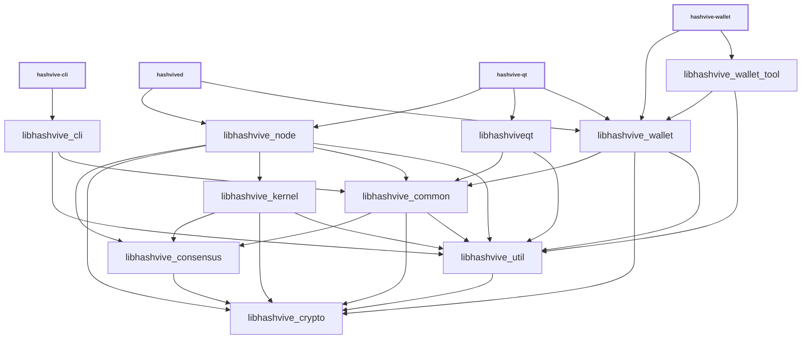

# Libraries

| Name                      | Description                                                                                                                                                        |
| ------------------------- | ------------------------------------------------------------------------------------------------------------------------------------------------------------------ |
| _libhashvive_cli_         | RPC client functionality used by _hashvive-cli_ executable                                                                                                         |
| _libhashvive_common_      | Home for common functionality shared by different executables and libraries. Similar to _libhashvive_util_, but higher-level (see [Dependencies](#dependencies)).  |
| _libhashvive_consensus_   | Consensus functionality used by _libhashvive_node_ and _libhashvive_wallet_.                                                                                       |
| _libhashvive_crypto_      | Hardware-optimized functions for data encryption, hashing, message authentication, and key derivation.                                                             |
| _libhashvive_kernel_      | Consensus engine and support library used for validation by _libhashvive_node_.                                                                                    |
| _libhashviveqt_           | GUI functionality used by _hashvive-qt_ and _hashvive-gui_ executables.                                                                                            |
| _libhashvive_ipc_         | IPC functionality used by _hashvive-node_, _hashvive-wallet_, _hashvive-gui_ executables to communicate when [`-DWITH_MULTIPROCESS=ON`](multiprocess.md) is used.  |
| _libhashvive_node_        | P2P and RPC server functionality used by _hashvived_ and _hashvive-qt_ executables.                                                                                |
| _libhashvive_util_        | Home for common functionality shared by different executables and libraries. Similar to _libhashvive_common_, but lower-level (see [Dependencies](#dependencies)). |
| _libhashvive_wallet_      | Wallet functionality used by _hashvived_ and _hashvive-wallet_ executables.                                                                                        |
| _libhashvive_wallet_tool_ | Lower-level wallet functionality used by _hashvive-wallet_ executable.                                                                                             |
| _libhashvive_zmq_         | [ZeroMQ](../zmq.md) functionality used by _hashvived_ and _hashvive-qt_ executables.                                                                               |

## Conventions

- Most libraries are internal libraries and have APIs which are completely unstable! There are few or no restrictions on backwards compatibility or rules about external dependencies. An exception is _libhashvive_kernel_, which, at some future point, will have a documented external interface.

- Generally each library should have a corresponding source directory and namespace. Source code organization is a work in progress, so it is true that some namespaces are applied inconsistently, and if you look at [`add_library(hashvive_* ...)`](../../src/CMakeLists.txt) lists you can see that many libraries pull in files from outside their source directory. But when working with libraries, it is good to follow a consistent pattern like:

  - _libhashvive_node_ code lives in `src/node/` in the `node::` namespace
  - _libhashvive_wallet_ code lives in `src/wallet/` in the `wallet::` namespace
  - _libhashvive_ipc_ code lives in `src/ipc/` in the `ipc::` namespace
  - _libhashvive_util_ code lives in `src/util/` in the `util::` namespace
  - _libhashvive_consensus_ code lives in `src/consensus/` in the `Consensus::` namespace

## Dependencies

- Libraries should minimize what other libraries they depend on, and only reference symbols following the arrows shown in the dependency graph below:

<table><tr><td>

</td></tr><tr><td>

**Dependency graph**. Arrows show linker symbol dependencies. _Crypto_ lib depends on nothing. _Util_ lib is depended on by everything. _Kernel_ lib depends only on consensus, crypto, and util.

</td></tr></table>

- The graph shows what _linker symbols_ (functions and variables) from each library other libraries can call and reference directly, but it is not a call graph. For example, there is no arrow connecting _libhashvive_wallet_ and _libhashvive_node_ libraries, because these libraries are intended to be modular and not depend on each other's internal implementation details. But wallet code is still able to call node code indirectly through the `interfaces::Chain` abstract class in [`interfaces/chain.h`](../../src/interfaces/chain.h) and node code calls wallet code through the `interfaces::ChainClient` and `interfaces::Chain::Notifications` abstract classes in the same file. In general, defining abstract classes in [`src/interfaces/`](../../src/interfaces/) can be a convenient way of avoiding unwanted direct dependencies or circular dependencies between libraries.

- _libhashvive_crypto_ should be a standalone dependency that any library can depend on, and it should not depend on any other libraries itself.

- _libhashvive_consensus_ should only depend on _libhashvive_crypto_, and all other libraries besides _libhashvive_crypto_ should be allowed to depend on it.

- _libhashvive_util_ should be a standalone dependency that any library can depend on, and it should not depend on other libraries except _libhashvive_crypto_. It provides basic utilities that fill in gaps in the C++ standard library and provide lightweight abstractions over platform-specific features. Since the util library is distributed with the kernel and is usable by kernel applications, it shouldn't contain functions that external code shouldn't call, like higher level code targeted at the node or wallet. (_libhashvive_common_ is a better place for higher level code, or code that is meant to be used by internal applications only.)

- _libhashvive_common_ is a home for miscellaneous shared code used by different Hashvive applications. It should not depend on anything other than _libhashvive_util_, _libhashvive_consensus_, and _libhashvive_crypto_.

- _libhashvive_kernel_ should only depend on _libhashvive_util_, _libhashvive_consensus_, and _libhashvive_crypto_.

- The only thing that should depend on _libhashvive_kernel_ internally should be _libhashvive_node_. GUI and wallet libraries _libhashviveqt_ and _libhashvive_wallet_ in particular should not depend on _libhashvive_kernel_ and the unneeded functionality it would pull in, like block validation. To the extent that GUI and wallet code need scripting and signing functionality, they should be get able it from _libhashvive_consensus_, _libhashvive_common_, _libhashvive_crypto_, and _libhashvive_util_, instead of _libhashvive_kernel_.

- GUI, node, and wallet code internal implementations should all be independent of each other, and the _libhashviveqt_, _libhashvive_node_, _libhashvive_wallet_ libraries should never reference each other's symbols. They should only call each other through [`src/interfaces/`](../../src/interfaces/) abstract interfaces.

## Work in progress

- Validation code is moving from _libhashvive_node_ to _libhashvive_kernel_ as part of [The libhashvivekernel Project #27587](https://github.com/hashvive/hashvive/issues/27587)
